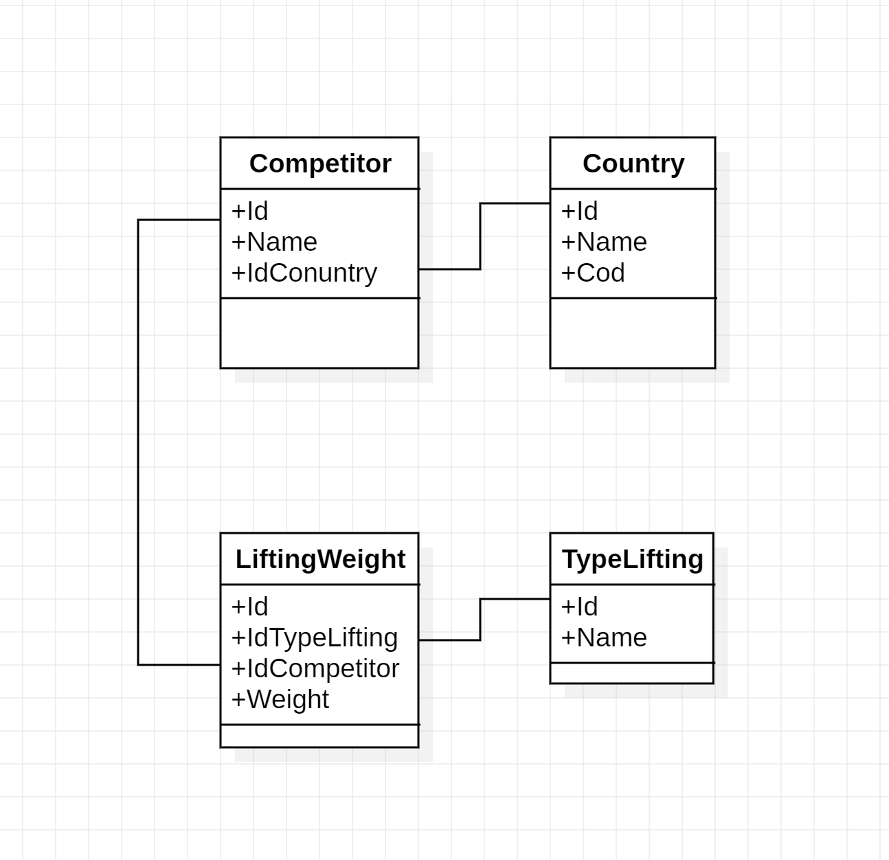

Basic idea of the weightlifting api

Records when returned must be sorted from highest total weight to lowest total weight.

Each competitor can have 3 records per lift type, but will only return the best one (replacing the one with the lowest weight?).

Implement log to file or to a table with dependency injection